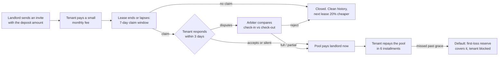
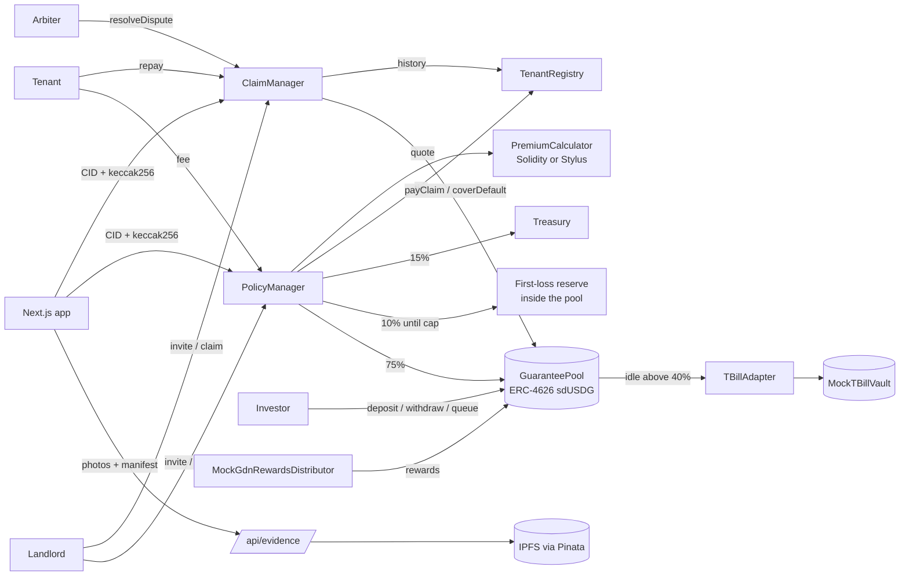

# SafeDeposit Zero

**Move in without a big deposit.** Tenants pay a small monthly fee. An on-chain USDG pool on Arbitrum guarantees the landlord up to the full deposit.

*Tenants keep their cash, landlords stay protected, and investors earn real-world yield from rent guarantees on Arbitrum.*

Built for the Arbitrum Open House Singapore Online Buildathon. Stack: Solidity (Foundry, OpenZeppelin 5), an optional Arbitrum Stylus premium engine in Rust, Paxos USDG, Next.js.

---

## The problem

A security deposit is one to two months of rent, paid up front and locked for the whole lease. It earns the tenant nothing. At move-out it often comes back late, cut, or not at all. Example: rent $1,000 with a 2-month deposit means **$2,000 extra on day one**, locked for 12 months. Landlords don't need the cash; they need a guarantee that damage or unpaid rent will be covered.

## How it works



1. **The landlord sends an invite** with the deposit they'd normally ask for, plus check-in photos pinned to IPFS.
2. **The tenant pays a small monthly fee** (e.g. $15/month instead of $2,000 up front). The fee comes from their rental history on SafeDeposit Zero. They can add their own move-in photos in the first 3 days to flag damage that was already there.
3. **The tenant moves out.** The landlord has 7 days to file a claim (damage, unpaid rent or other) with photos.
4. **It settles.** No claim: nothing to do, and the tenant's next lease is 20% cheaper. If the tenant accepts or stays silent past the deadline, the pool pays the landlord immediately. If they dispute, a neutral arbiter decides (full, partial or reject). The tenant then repays the pool in installments.

## Who gets what

| | Puts in | Gets |
|---|---|---|
| Tenant | A small monthly fee | Moves in without locking a deposit |
| Landlord | Nothing extra | Protection up to the full deposit, paid within minutes on approved claims |
| Investor | USDG into the pool | Yield from rent fees, USDG rewards and treasuries |
| SafeDeposit Zero | Runs the protocol | 25% of each fee, part of it locked as first-loss capital |

## Business model

- **Protocol fee: 25% of every premium.** 40% of that (10% of the premium) goes to the **first-loss reserve** until it holds 5% of pool assets; the rest goes to the treasury. Once the reserve is full, the treasury gets the whole 25%.
- **Dispute fee: 2% of the claimed amount, minimum $10.** Charged only when the tenant disputes and the arbiter approves the **full** amount. It's added to the tenant's debt; the pool is repaid first and the fee reaches the treasury last.
- **Roadmap (not built):** operator SaaS (multi-unit dashboard, reporting, API) and a GDN partner revenue share.

**Pricing** (`PremiumCalculator`, pure integer math):

```
annualPremium  = coverage × 9% × termFactor × tierMultiplier
monthlyPremium = max(ceilToCent(annualPremium / 12), 5 USDG)
```

termFactor: 6 months 1.10, 12 months 1.00. Tier comes from the on-chain `TenantRegistry`, never from the landlord: **B** (new renter) 1.00, **A** (a lease ended with no claim) 0.80, **C** (a past paid claim) 1.30. Open or defaulted debts block new guarantees. Example: $2,000, 12 months, tier B → $180/yr → **$15.00/month**.

### Unit economics (illustrative)

1,000 policies × $2,000 coverage, tier B, 12 months; $1M of pool capital (50% reserve of $2M coverage).

| Line | Per year |
|---|---|
| Premiums paid by tenants | $180,000 |
| → Pool (75%) | +$135,000 |
| → First-loss reserve (10%, until it holds $50,000) | $18,000 |
| → Treasury (15%) | $27,000 |
| USDG partner rewards on idle cash (40% × $1M × ~3.0%) | +$12,000 |
| T-bill yield (60% × $1M × ~3.4%) | +$20,400 |
| Net claims after tenant repayments (35% of premiums) | −$63,000 |
| **Investor net** | **+$104,400 ≈ 10.4% APY** |

| Scenario | Normal | Bad year | Disaster |
|---|---|---|---|
| Net claims | −$63,000 | −$180,000 | −$600,000 |
| Investor result | **+$104,400 (+10.4%)** | **−$12,600 (−1.3%)** before first-loss | **−$432,600 (−43.3%)** |
| Share price | 1.000 → 1.104 | 1.000 → 0.987 | 1.000 → 0.567 |

Investors only lose once net claims pass about **$167K/yr ≈ 93% of premiums**. The most an investor can lose is what they deposited. Landlords stay paid because the 50% reserve lets the pool pay even if half of all tenants claim in full at once.

## Where the yield comes from

1. **Premiums (75%).** Real-economy cash flow, uncorrelated with crypto prices.
2. **USDG partner rewards.** Paxos shares reserve yield with Global Dollar Network partners on the USDG they hold. The pool keeps 40% idle for instant payouts, so the idle cash earns too. Testnet: `MockGdnRewardsDistributor` (3% APR, simulated, permissionless `distributeRewards()`).
3. **Tokenized T-bills.** Capital above the 40% liquidity target goes through `IYieldAdapter` → `TBillAdapter` → `MockTBillVault` (3.4% APR, simulated). Production: BUIDL or BENJI with only a new adapter.
4. **Recoveries.** Tenant repayments of paid claims and missed fees.

Not used: DeFi farming, leverage, token emissions.

```
grossAssets = idle USDG + T-bill position
totalAssets = grossAssets − firstLossBalance − pendingClaims          (what sdUSDG is priced on)
netAPY      = (premiums + USDG rewards + T-bill yield + recoveries + first-loss covers − claims paid)
              ÷ time-weighted average assets × (365 days / period)
```

Tenant debt is **not** counted until repaid. Filed claims lower the share price immediately, so nobody can withdraw ahead of a known loss; a rejected claim restores it.

## Risk controls enforced on-chain

| Control | Rule |
|---|---|
| Reserve ratio | `totalAssets ≥ 50% × activeCoverage` after any activation or withdrawal, else `ReserveTooLow` |
| Concentration | One landlord's coverage ≤ max($20,000, 10% of pool capacity), else `ConcentrationTooHigh` |
| Coverage cap | ≤ 10,000 USDG per policy; claim ≤ coverage; one claim per policy |
| First-loss reserve | Funded by the protocol fee, excluded from investor assets, never withdrawable by the admin, spent only by `coverDefault` |
| Pending claims | Priced into `totalAssets` the moment a claim is filed |
| Withdrawal queue | Anything above what's free waits in a FIFO queue (`requestRedeem` / `processQueue(maxCount)` / `cancelRedeem`); escrowed shares keep gains and losses |
| Underwater guard | Deposits refuse while open claims exceed investor assets, so new money never fills an old hole |
| Pause | Stops new invites, activations and deposits; claims, repayments, the queue and free withdrawals keep working |
| Lapse | Damage before a lapse stays covered; the landlord gets a claim window from the lapse; the missed fee joins the debt |
| Bounded admin | e.g. protocol fee ≤ 40%, min reserve 30–100%, first-loss cap ≤ 20%; every change emits `ParamsUpdated` |
| Engineering | SafeERC20, `decimals()` read on-chain, CEI + `nonReentrant` on fund movement, custom errors, events on every state change, bounded loops, string length caps, ERC-4626 virtual-share offset + seed deposit |

## Architecture



| Contract | Role |
|---|---|
| `GuaranteePool` | ERC-4626 vault (USDG → sdUSDG): reserve, concentration, first-loss, pending claims, queue, liquidity target, payouts |
| `PolicyManager` | Invites, policy lifecycle, tier pricing, 75 / 10 / 15 split, move-in notes, keeper transitions |
| `ClaimManager` | Claims, disputes, arbiter decisions, tenant debt, installments, defaults |
| `TenantRegistry` | Rental history per tenant → tier A / B / C or blocked |
| `PremiumCalculatorSol` / Stylus `PremiumCalculator` | Pricing, identical ABI and math; the Rust crate is in `stylus/premium-calculator` |
| `TBillAdapter` + `MockTBillVault` | Idle capital → tokenized T-bills (simulated on testnet) |
| `MockGdnRewardsDistributor` | USDG partner rewards on idle cash (simulated on testnet) |
| `MockUSDG` | Testnet-only USDG stand-in with public mint |

## Addresses

Both testnets run the demo time profile (1 minute = 1 month) with MockUSDG, and every contract is verified on the
chain's Blockscout explorer. The same address can be a different contract on each chain, so always read the row and
column together.

| Contract | Arbitrum Sepolia | Robinhood Chain testnet |
|---|---|---|
| USDG (MockUSDG) | [`0x216f…2b73`](https://arbitrum-sepolia.blockscout.com/address/0x216f1d0698D56F8A8D789B73F3ffc9F9784F2b73) | [`0xE96E…A458`](https://explorer.testnet.chain.robinhood.com/address/0xE96E1bc96dEC0EDc64fE9F03D35d0acA6E49A458) |
| GuaranteePool | [`0x1A8E…eB98`](https://arbitrum-sepolia.blockscout.com/address/0x1A8E77B36EeeF1f6d2f84579d08548fe75eAeB98) | [`0xcFa0…8ce1`](https://explorer.testnet.chain.robinhood.com/address/0xcFa083349A227036472AA2ef63Bb43F027c38ce1) |
| PolicyManager | [`0x8711…6C1B`](https://arbitrum-sepolia.blockscout.com/address/0x8711B0F56c5F7e9d86Cd4e68908F1C0034306C1B) | [`0x1A8E…eB98`](https://explorer.testnet.chain.robinhood.com/address/0x1A8E77B36EeeF1f6d2f84579d08548fe75eAeB98) |
| ClaimManager | [`0xA09D…947B`](https://arbitrum-sepolia.blockscout.com/address/0xA09Dc5b515E09F69Ed27D2e9E2EB86E8D3D1947B) | [`0x8711…6C1B`](https://explorer.testnet.chain.robinhood.com/address/0x8711B0F56c5F7e9d86Cd4e68908F1C0034306C1B) |
| TenantRegistry | [`0xcFa0…8ce1`](https://arbitrum-sepolia.blockscout.com/address/0xcFa083349A227036472AA2ef63Bb43F027c38ce1) | [`0x963F…A24B`](https://explorer.testnet.chain.robinhood.com/address/0x963Fd245e5FD69a107B60F42A0c1B862FC72A24B) |
| PremiumCalculatorSol | [`0x963F…A24B`](https://arbitrum-sepolia.blockscout.com/address/0x963Fd245e5FD69a107B60F42A0c1B862FC72A24B) | [`0x216f…2b73`](https://explorer.testnet.chain.robinhood.com/address/0x216f1d0698D56F8A8D789B73F3ffc9F9784F2b73) |
| MockTBillVault | [`0xec5b…5b81`](https://arbitrum-sepolia.blockscout.com/address/0xec5b5146f831575CFFf299FBd9964f320Ebe5b81) | [`0xA09D…947B`](https://explorer.testnet.chain.robinhood.com/address/0xA09Dc5b515E09F69Ed27D2e9E2EB86E8D3D1947B) |
| TBillAdapter | [`0xa799…35E5`](https://arbitrum-sepolia.blockscout.com/address/0xa79905Fb3aa63230a62ABf073d8afAD4F69935E5) | [`0xec5b…5b81`](https://explorer.testnet.chain.robinhood.com/address/0xec5b5146f831575CFFf299FBd9964f320Ebe5b81) |
| MockGdnRewardsDistributor | [`0x1D12…C85f`](https://arbitrum-sepolia.blockscout.com/address/0x1D1259153A5FA744412D3FE153fEE90AecF9C85f) | [`0xa799…35E5`](https://explorer.testnet.chain.robinhood.com/address/0xa79905Fb3aa63230a62ABf073d8afAD4F69935E5) |

Admin and treasury: `0xa5c3e9feaf785b1bae0e766ecf4368156a23a7a0`. Robinhood USDG for the real-token path:
`0x7E955252E15c84f5768B83c41a71F9eba181802F`.

## Run it

```bash
# Contracts: build and test (local only, no fork, no RPC)
cd contracts && forge build && forge test
forge coverage --report summary --no-match-coverage "(test|script)"

# Frontend on mock data. Every flow works with no wallet.
cd frontend && npm install && npm run dev      # http://localhost:3000

# Optional Stylus engine (Windows without MSVC Build Tools: use Docker)
cd stylus/premium-calculator && cargo test
```

In mock mode the wallet menu switches between demo wallets: Ayu (returning tenant), Dimas (new renter, opens invite links), Harbor Co-living (landlord), Mei Lin (investor), Rahul (arbiter) and SafeDeposit operations (admin). The banner has **Skip 1 month** (1 minute = 1 month) and **Demo controls**: reject the next transaction, simulate the wrong network, reset the data.

Deploying: [DEPLOY-CHECKLIST.md](DEPLOY-CHECKLIST.md) (step by step, both chains) and [INTEGRATION.md](INTEGRATION.md) (method → contract table).

## Test results

**Foundry: 181 tests, all passing** — unit, flow, fuzz (512 runs each) and handler-based invariants (128 runs × 64 calls).

```
unit/PolicyManager       43     unit/ClaimManager        36     unit/GuaranteePool   36
unit/PremiumCalculator   17     unit/Yield                8     unit/RewardsAndRegistry 11
flow/Flows               16     fuzz/Fuzz                 7     invariant/Invariants  7
Ran 10 test suites: 181 tests passed, 0 failed, 0 skipped
```

- **Flows (SPEC §7.12):** no claim → clean record → tier A next time; claim accepted; silence → auto-accept; dispute full (+fee), partial, rejected; lapse → claim → debt including the missed fee; full repayment; default → first-loss covers → tenant blocked; concentration cap; reserve cap on activation and on withdraw; withdrawal queue (request, partial stop, cancel, FIFO); pending claim lowers the price and rejection restores it; rebalance and adapter pull on a claim; USDG rewards raise the price; plus the full §9 demo script with exact numbers.
- **Invariants:** the reserve holds after any activation, withdrawal or queue payout; the premium split sums exactly; `activeCoverage` equals the coverage of Active/Lapsed/Ended/Claimed policies; first-loss only shrinks through `coverDefault`; the share price only drops on a claim filing/payment or a default; approved ≤ claimed ≤ coverage; queued shares are always escrowed by the pool.
- **Fuzz:** quote bounds, deposit/redeem round trip, withdrawals never break the reserve, claim ≤ coverage, debt matches the decision, repayment order pool-first.

| File | Lines | Statements | Branches | Functions |
|---|---|---|---|---|
| ClaimManager.sol | 99.4% | 98.2% | 88.6% | 100% |
| GuaranteePool.sol | 99.1% | 96.0% | 75.7% | 98.0% |
| PolicyManager.sol | 98.9% | 99.2% | 97.4% | 96.7% |
| TenantRegistry.sol | 100% | 100% | 100% | 100% |
| PremiumCalculatorSol.sol | 100% | 100% | 100% | 100% |
| **All src** | **99.1%** | **97.4%** | **85.1%** | **97.8%** |

The invariant fuzzer found one real issue during this build (new deposits could be absorbed by open claims larger than the pool's free assets); the underwater guard above fixes it.

## Demo script (≤ 3 minutes)

1. **Investor** deposits 5,000 USDG. Share price, reserve and first-loss are shown.
2. **Landlord** creates an invite: "Unit 12B, Orchard", rent $2,000, coverage $2,000, 12 months, check-in photos pinned to IPFS.
3. **Tenant** (new wallet → tier B) opens the link and pays the first $15. The certificate stamps in. Ledger: pool +$11.25, first-loss +$1.50, treasury +$2.25.
4. A month later the tenant pays again. Distribute USDG rewards: the share price ticks up.
5. The lease ends. The **landlord** files a $300 claim with check-out photos. The investor sees pending claims lower the price.
6. The **tenant** disputes. The **arbiter** compares the photos and the tenant's move-in notes and approves $200. The pool pays the landlord instantly; the tenant owes $200 in 6 installments.
7. The tenant repays $70. Pool assets rise.
8. The seeded defaulted debt: the first-loss reserve covered it and the tenant is blocked. Close on the investor page: *"Yield from rent guarantees, USDG rewards and treasuries, not token emissions."*

Demo video: TODO

## Roadmap

Stylus premium engine on mainnet · independent arbiter panel · GDN partner onboarding with Paxos · real BUIDL/BENJI allocation · operator SaaS · tier C bonds · junior/senior pool tranches · portable, credit-bureau-style rental history.

## Repository

```
contracts/                    Foundry: src/, test/{unit,flow,fuzz,invariant}, script/ (Deploy.s.sol, Seed.s.sol)
stylus/premium-calculator/    Optional Rust Stylus pricing engine + tests
frontend/                     Next.js app; lib/data/{types,source,mock,onchain}.ts; app/api/evidence; config/; abi/
scripts/export-abis.mjs       forge out/ → frontend/abi/
docs/PROGRESS.md              build log and decisions
KONTEKS/                      SPEC v3, UI brief, agent rules
INTEGRATION.md · DEPLOY-CHECKLIST.md
```

Testnet demo. Not financial advice. USDG rewards and T-bill yield are simulated on testnet.
