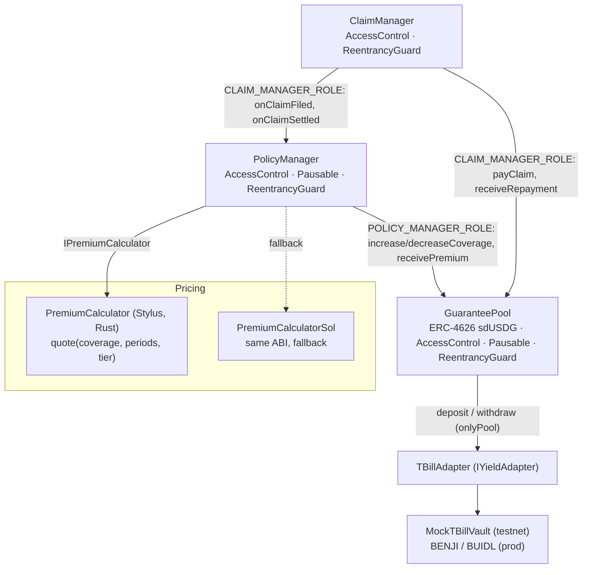

> **Superseded (3 Oct 2026):** this describes the first build. The current design follows SPEC v3 (`KONTEKS/docs/SPEC.md`); see the README for the v3 architecture, money flows and risk controls.

# Architecture

## Contracts and permissions



| Role | Holder | Can |
|---|---|---|
| `DEFAULT_ADMIN_ROLE` | deployer (multisig in prod) | bounded parameter setters, pause, set treasury / calculator / yield adapter, reassign arbiter |
| `POLICY_MANAGER_ROLE` (pool) | PolicyManager | change `activeCoverage`, record premiums |
| `CLAIM_MANAGER_ROLE` (pool, PolicyManager) | ClaimManager | pay claims, record repayments, move policies to Claimed / Closed |
| `ARBITER_ROLE` | arbiter wallets | `resolveDispute` |
| none (keeper) | anyone | `endLease`, `closeIfNoClaim`, `markLapsed`, `autoAcceptClaim`, `markDefault`, `rebalance` |

## Money flows

```
Tenant ──monthly premium──► PolicyManager ──75%──► GuaranteePool
                                          └─25%──► Treasury
Investor ──USDG──► GuaranteePool ──idle above 20% buffer──► TBillAdapter ──► T-bill vault
Approved claim:  GuaranteePool ──► Landlord ; tenant Debt = approved (+ dispute fee if tenant disputed and lost)
Repayment:       Tenant ──► GuaranteePool first, then the dispute-fee part ──► Treasury
```

## Pool accounting

- `totalAssets = idle USDG + adapter.totalValue()`. Tenant debt is not counted.
- The share price rises with premiums, T-bill accrual and recoveries, and falls only on claim payouts (this is an invariant test).
- Reserve: `totalAssets ≥ ceil(activeCoverage × minReserveBps / 10_000)`, checked when coverage increases and on every withdrawal or redeem.
- Liquidity: claims pay from idle cash first and pull the rest from the adapter.

## Time profiles

| Param | Production | Demo |
|---|---|---|
| Premium period | 30 days | 1 minute |
| Grace period | 7 days | 1 minute |
| Lease length | 6–24 periods | 5–10 periods |
| Claim window after lease end | 7 days | 3 minutes |
| Tenant response window | 3 days | 2 minutes |
| Arbiter decision window | 5 days | 5 minutes |
| Debt installment period / count | 30 days × 6 | 1 minute × 3 |
| T-bill speed-up (`timeMultiplier`) | 1 | 43,200 (1 minute = 1 month) |

Fixed at deploy via `TimeConfig` (`TimeProfiles.demo()` / `TimeProfiles.prod()`).

**Pricing note:** leases shorter than 6 periods exist only in the demo profile. They are priced at the standard 1.00 term factor, so the demo invite (5 periods, $2,000, tier B) quotes the reference $15.00/month.

## Frontend data layer

```
components/pages ──► hooks (React Query) ──► dataSource (lib/data/index.ts)
                                              ├─ MockDataSource   (in-memory state machine, default)
                                              └─ OnchainDataSource (viem/wagmi, stubs documented, not wired)
```

UI components never import contract calls. The switch is `NEXT_PUBLIC_DATA_SOURCE=mock|onchain`.
