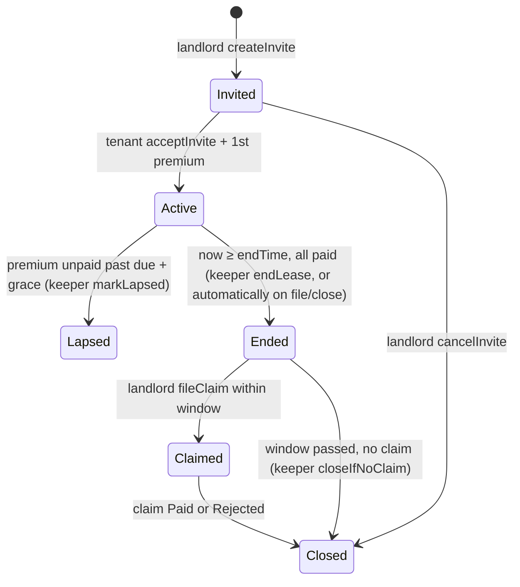
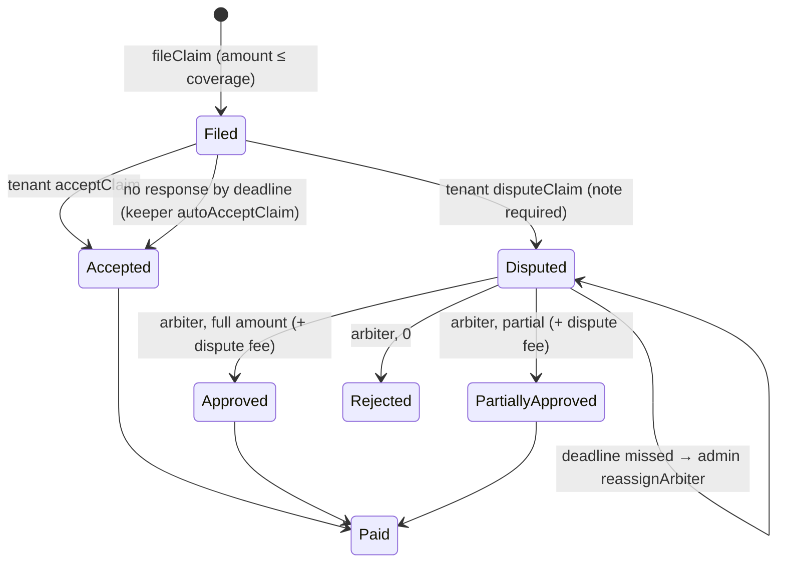

> **Superseded (3 Oct 2026):** this describes the first build. The current design follows SPEC v3 (`KONTEKS/docs/SPEC.md`); see the README for the v3 architecture, money flows and risk controls.

# State machines and flows

## Policy

Coverage counts toward `activeCoverage` while the policy is Active, Ended or Claimed. Lapsed policies can't be claimed.

## Claim

On **Paid**: the pool pays `amountApproved` to the landlord, a tenant `Debt` is created, the policy is closed and its coverage released.

**Silence rule** (shown in the tenant UI): *"If you don't respond by {time}, the claim is accepted."*

## Debt

- `repay(claimId, amount)` works at any time, from anyone, and overpayment is capped. The pool portion is repaid first, then the dispute fee goes to the treasury.
- Installments: 6 in production, 3 in the demo. `nextInstallmentDue` moves forward as whole installments are covered.
- `markDefault` (keeper) works once an installment is overdue past the grace period. It records rental history only; there is no further on-chain action in the MVP.

## Write UX

Every write shows explicit steps: **1 Approve USDG** (only if `allowance < amount`) → **2 the action**. Each step goes waiting for wallet → confirming (with an explorer link) → done. The success toast reuses the button's verb ("Guarantee purchased", "Claim filed", "Deposited").
